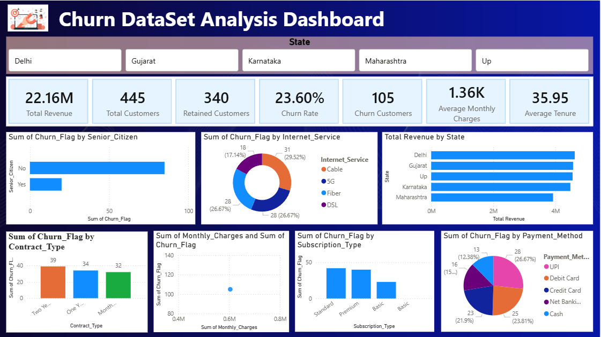

# Churn-DataSet-Analysis-Dashboard

📊 Churn Data Analysis Dashboard

🔎 Project Overview

This portfolio project demonstrates a complete customer churn data analytics workflow — from a raw Excel dataset to a cleaned analysis-ready dataset, SQL exploration, and an interactive Power BI dashboard.

The project focuses on understanding customer retention, churn behaviour, revenue distribution, subscription patterns, contract types, payment methods, and customer segments.

🔄 End-to-End Workflow

Raw Excel Dataset
       ↓
Python + Pandas Cleaning
       ↓
Feature Engineering
       ↓
Clean CSV Dataset
       ↓
MySQL Analysis
       ↓
Power BI Dashboard
       ↓
Business Insights

🖼️ Dashboard Preview

The repository includes the dashboard screenshot shown above so visitors can quickly understand the final output before opening the .pbix file.

Dashboard includes

Area

Visual / KPI

📌 Overview

Total Revenue, Customers, Retained Customers, Churn Rate, Churn Customers

💰 Revenue

Total Revenue by State

👥 Customer Segments

Senior Citizen / Adult analysis

🌐 Services

Internet Service analysis

📄 Contracts

Churn by Contract Type

💳 Payments

Churn by Payment Method

📦 Subscriptions

Churn by Subscription Type

📈 Customer Value

Monthly Charges and Customer/Churn relationship

🎛️ Filters

State-based interactive slicer

🎯 Objectives

Clean and standardize a messy customer dataset.

Identify important customer churn patterns.

Measure churn rate and customer retention.

Analyze revenue across states and customer segments.

Compare churn across contract, subscription, payment, and internet-service categories.

Create an interactive dashboard for business-oriented analysis.

🧰 Tech Stack

Data Preparation

Python

Pandas

NumPy

Jupyter Notebook

Excel / CSV

Data Analysis

MySQL

SQL

Visualization & BI

Microsoft Power BI

🧹 Data Cleaning Process

The Python notebook performs a practical cleaning pipeline:

Load the raw Excel dataset.

Inspect structure, statistics, nulls, duplicates and data types.

Remove duplicate records.

Replace dirty placeholders such as N/A, NULL and blank values with missing values.

Remove unnecessary spaces from text columns.

Standardize categorical text values.

Standardize the Churn column to Yes / No.

Convert age, tenure and charge fields to numeric values.

Remove invalid ages outside the 18–100 range.

Remove negative charge values.

Convert the last-interaction column into a date field.

Handle remaining missing values.

Create analytical features.

Validate the final dataset.

Export the cleaned CSV.

Load the cleaned data into MySQL for SQL analysis.

Before → After

Stage

Records

Raw Excel dataset

542

Cleaned dataset

492

Records removed/filtered

50

🧠 Feature Engineering

The cleaned dataset contains additional analysis-friendly fields:

Feature

Logic

Customer_Value

Monthly_Charges × Tenure_Months

Monthly_Revenue

Based on Monthly_Charges

Tenure_Group

0-12, 13-24, 25-48, 49-72 months

Senior_Flag

Senior when age ≥ 60, otherwise Adult

Churn_Flag

Yes → 1, No → 0

🗄️ SQL Analysis

The sql.sql file contains analytical queries covering:

Total customers

Total churned customers

Churn rate

Average monthly charges

Average customer tenure

Customers by contract type

Customers by internet service

Churned customers by state

Customers by payment method

Customers by subscription type

Revenue by state

Average charges by contract

Senior-citizen churn

Top 10 high-value customers

Customers without technical support

Example:

SELECT
    ROUND(
        SUM(CASE WHEN Churn = 'Yes' THEN 1 ELSE 0 END) * 100 / COUNT(*),
        2
    ) AS Churn_Rate
FROM customer_churn;

📊 Power BI Dashboard

The interactive Power BI dashboard provides insights into customer churn, revenue, customer retention, monthly charges, contract types, subscription types, internet services, and state-wise revenue.

### Dashboard Preview

The Power BI report provides an interactive business view of the cleaned churn data.

Main KPIs

Total Revenue

Total Customers

Retained Customers

Churn Rate

Churn Customers

Average Monthly Charges

Average Tenure

Main Visuals

Churn by Senior Citizen status

Churn by Internet Service

Total Revenue by State

Churn by Contract Type

Monthly Charges vs Churn

Churn by Subscription Type

Churn by Payment Method

State slicer for interactive filtering

📌 Example Dashboard Snapshot

The values visible in the screenshot represent one selected dashboard state. Changing the State filter can change the KPI cards and visual totals.

📁 Repository Structure

Churn-Data-Analysis/
│
├── README.md
├── Churn dataset cleaning.ipynb
├── Churn_Unclean_Project.xlsx
├── Clean_Churn_Data.csv
├── sql.sql
├── PowerBI Dekstop.pbix
├── abstract-wave-background-colorful-gradient_1040088-493.avif
│
└── assets/
    └── churn-dashboard.png

🚀 How to Run

1️⃣ Run Python Data Cleaning

Install the packages:

pip install pandas numpy openpyxl sqlalchemy pymysql jupyter

Open the notebook:

jupyter notebook "Churn dataset cleaning.ipynb"

Run the notebook from top to bottom. It generates Clean_Churn_Data.csv.

2️⃣ Run SQL Analysis

Create a MySQL database and table, then use the cleaned dataset with the queries in sql.sql.

CREATE DATABASE churndb;
USE churndb;

Security: never commit your real database password, API key, or other credentials to GitHub. Use environment variables or a local configuration file instead.

3️⃣ Open the Power BI Report

Open:

PowerBI Dekstop.pbix

Refresh the data connection if required, then use the dashboard slicers and visuals to explore the analysis.

💡 Key Takeaways from the Project

Demonstrates a realistic ETL-style analytics workflow.

Combines Python, SQL and Power BI in one project.

Shows practical data quality handling before visualization.

Converts raw customer fields into useful analytical features.

Produces a dashboard suitable for exploring customer retention and churn patterns.

👤 Author

Shivaji Gorakh Zine

Computer Engineering | Data Analytics & Business Intelligence 
